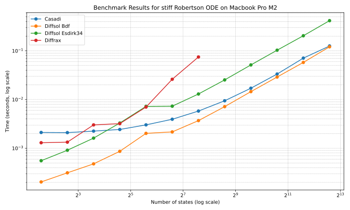

Robertson ODE Benchmark
=======================

This is a benchmark on a stiff ODE system, using the classic testcase, the Robertson (1966) problem, 
which models the  kinetics of an autocatalytic reaction. This testscase can be written as an ODE 
given by the following set of equations:

.. math:: 
   :nowrap:
   \begin{align}
   \frac{dx}{dt} &= -0.04x + 10^4 y z \\
   \frac{dy}{dt} &= 0.04x - 3 \cdot 10^7 y^2 - 10^4 y z  \\
   \frac{dz}{dt} &= 3 \cdot 10^7 y^2 \\
   \end{align}
   
with initial conditions:
.. math:: 
   :nowrap:
   \begin{align}
   x(0) &= 1 \\
   y(0) &= 0 \\
   z(0) &= 0 \\
   \end{align}

This problem is known to be stiff due to the presence of widely varying timescales in the solution.

We can extend this problem to a larger system by creating multiple groups of the Robertson equations, 
where each group is independent of the others. This allows us to benchmark the performance of different
ODE solvers as we increase the size of the system.

Solvers
-------

We benchmark the following solvers:
- Diffsol BDF method
- Diffsol ESDirk34 method
- CasADi's CVODE solver
- Diffrax's Kvaerno5 solver
  
In terms of methods, both the Diffsol BDF and CasADi CVODE are implicit BDF methods so are closest in
comparison. Both the Diffsol ESDirk34 and Diffrax Kvaerno5 are implicit Runge-Kutta methods, with the latter being of higher order.

Benchmark Setup
-----------------

For each solver, we perform as much initial setup as possible outside of the timing loop to ensure a fair comparison, using a function called `setup`.
The actual benchmark is performed in a function called `bench`.

The code for the Diffsol solvers is shown below:

.. literalinclude:: ../../bench/diffsol_robertson_ode.py
   :encoding: latin-1
   :language: python
   
Note that for `ngroup < 20`` it uses the nalgebra dense matrix and LU solver, and for `ngroups >= 20` the faer sparse matrix and LU solver are used.
   
The code for the CasADi solver is shown below:

.. literalinclude:: ../../bench/casadi_robertson_ode.py
   :encoding: latin-1
   :language: python
   
The code for the Diffrax solver is shown below:

.. literalinclude:: ../../bench/diffrax_robertson_ode.py
   :encoding: latin-1
   :language: python

Differences between implementations
--------------------------------

There are a few key differences between the Diffrax, Casadi and Diffsol implementations that may affect the performance of the solvers. The main differences are:

- The Casadi implementation uses sparse matrices, whereas the Diffsol implementation uses dense matrices for ngroups < 20, and sparse matrices for ngroups >= 20. This will provide an advantage for Diffsol for smaller problems.
- I'm unsure if the Diffrax implementation uses sparse or dense matrices, but it is most likely dense as JAX only has experimental support for sparse matrices. Treating the Jacobian as dense will be a disadvantage for Diffrax for larger problems as the Jacobian is very sparse.
- The Diffsol BDF and Casadi CVODE solvers both use variable order BDF methods, whereas the Diffsol ESDirk34 and Diffrax Kvaerno5 solvers use fixed order implicit Runge-Kutta methods.
- Each library was allowed to use multiple threads according to their default settings. The only part of the Diffsol implementation that takes advantage of multiple threads is the faer sparse LU solver and matrix. Both the nalgebra LU solver, matrix, and the DiffSL generated code are all single-threaded. Diffrax uses JAX, which takes advantage of multiple threads (CPU only, no GPUs were used in these benchmarks). The Casadi implementation also uses multiple threads.

Results
-------

The benchmarks were run on:
   - A Dell PowerEdge R7525 2U rack server, with dual AMD EPYC 7343 3.2Ghz 16C CPU and 128GB Memory
   - A Macbook M2 Pro (14-inch, 2023) with 16GB Memory, 12 (8 performance and 4 efficiency) cores
     
The results are shown below:

   
The Diffsol implementation outperforms the other implementations significantly for smaller problem sizes, especially when using the rack server. 
At these small problem sizes, the dense matrix and solver used by Diffsol provide an advantage over the sparse solver used by Casadi. 
Casadi also has additional overhead to evaluate each function evaluation, as it needs to traverse a graph of operations to calculate each rhs or jacobian evaluation, 
whereas the DiffSL JIT compiler will compile to native code using the LLVM backend, along with low-level optimisations that are not available to Casadi. 
Diffrax is also significantly slower than Diffsol for smaller problems, this might be due to 
(a) Diffrax being a ML library and not optimised for solving stiff ODEs, 
or (b) double precision is used, which again is not a common use case for ML libraries.

As the problem sizes get larger the dense solver used by Diffrax becomes less efficient and the runtime starts to diverge from the other methods
The performance of Casadi improve rapidly relative to Diffsol as the problem size increases, and for `n > 256` it becomes faster than the Diffsol BDF method for the rack server. 
For the macbook the Casadi solver never becomes faster than the Diffsol BDF method, instead the two methods converge in performance. This is likely due to the better multi-threading
performance of the CVODE solver used by Casadi on the rack server, which has more CPU cores available.
