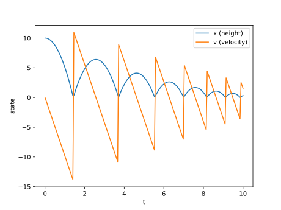

Example: Bouncing Ball
======================

A bouncing ball is a simple hybrid system with continuous dynamics between
impacts and a discrete state update at each impact.

The continuous model is:

.. math::

  \frac{d^2x}{dt^2} = -g

where \\(x\\) is height and \\(g\\) is gravitational acceleration. Introducing
velocity \\(v = dx/dt\\), we write:

.. math::

  \frac{dx}{dt} = v

.. math::

  \frac{dv}{dt} = -g

with initial conditions \\(x(0)=h\\), \\(v(0)=0\\).

At each ground contact, we apply a discrete reset:

.. math::

  v^+ = -e v^-

where \\(e\\) is the coefficient of restitution.

In DiffSL we define an event (root) function ``stop { x }`` so integration
halts when \\(x = 0\\). In this pydiffsol example, we:

1. call ``ode.solve_dense(...)`` on a fine grid from the current time to final time
2. if an event occurred, update ``solution.current_state`` with the bounce rule
3. continue solving from that updated state

.. literalinclude:: ../../examples/3_2_bouncing_ball.py
  :encoding: latin-1
  :lines: 1-71
  :language: python

