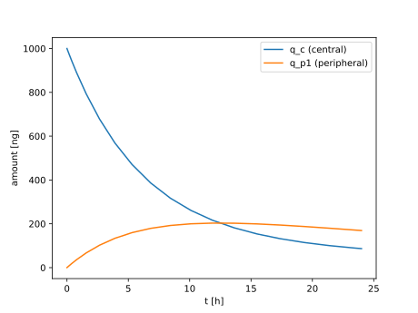

Example: Compartmental Models of Drug Delivery
==============================================

Pharmacokinetic (PK) models describe how a drug moves through the body using
compartments and rate processes (absorption, distribution, metabolism, and
excretion). In a two-compartment PK model we track drug amount in:

- a central compartment, \\(q_c\\)
- a peripheral compartment, \\(q_{p1}\\)

For linear clearance from the central compartment and linear exchange between
central and peripheral compartments, the model is:

.. math::

  \frac{dq_c}{dt} =
  - \frac{q_c}{V_c} CL
  - Q_{p1} \left( \frac{q_c}{V_c} - \frac{q_{p1}}{V_{p1}} \right)

.. math::

  \frac{dq_{p1}}{dt} =
  Q_{p1} \left( \frac{q_c}{V_c} - \frac{q_{p1}}{V_{p1}} \right)

with initial conditions \\(q_c(0)=1000\\) ng and \\(q_{p1}(0)=0\\) ng.

We use:

- \\(V_c = 1000\\) mL
- \\(V_{p1} = 1000\\) mL
- \\(CL = 100\\) mL/h
- \\(Q_{p1} = 50\\) mL/h

This Python version solves the model over a 24 hour window with multiple bolus dosing
events applied via hybrid stop/reset callbacks.

.. literalinclude:: ../../examples/3_1_compartmental_models_of_drug_delivery.py
  :encoding: latin-1
  :language: python

