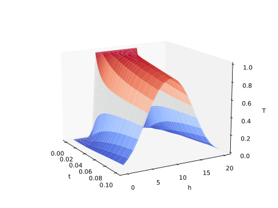

Example: Heat Equation
======================

We will now consider the heat equation as an example for a simple PDE. The heat equation is a PDE that describes how the temperature of a material changes over time. In one dimension, the heat equation is

\\[
\frac{\partial u}{\partial t} = D \frac{\partial^2 u}{\partial x^2}
\\]

where \\(u(x, t)\\) is the temperature of the material at position \\(x\\) and time \\(t\\), and \\(D\\) is the thermal diffusivity of the material. Please have a look at https://martinjrobins.github.io/diffsol/primer/heat_equation.html for the derivation of the diffsol model.

We can solve the one-dimensional heat equation using Diffsol with the following code:

.. literalinclude:: ../../examples/03_heat_equation.py
   :encoding: latin-1
   :language: python

The plot of the solution is shown below:

Let's calculate two variables by adding the temperature in celcius to the output of the model. This can be done by adding one line to the `out_i` section in the model::
        
    out_i {
        u_i,
        u_i - 273.15
    }

The plot of the solution in this case looks as follows:
 
.. image:: ../images/heat_equation_kelvin_and_celius.svg
  :width: 640
  :height: 480
  :alt: heat_equation_kelvin_and_celius.svg

As you can see, the two temperatures, one using Kelvin and one using Celsius, are concatenated into one array. One needs to manually split the array to separate the two variables.
